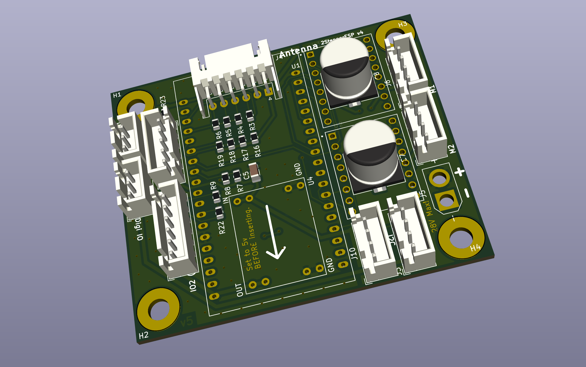
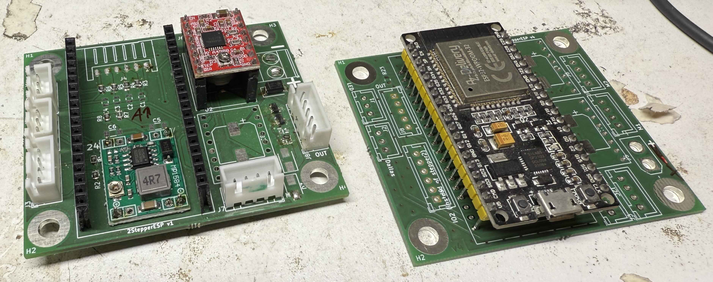

# PCB-ESP32-Stepper

## Description

This project features a **PCB design for ESP32 development boards** (DevKit). It is designed to host ESP32 boards and provides a robust platform for controlling stepper motors. The PCB includes two slots for stepper motor drivers, supporting both simple drivers and more advanced ones such as **Fysetc Trinamic drivers**. Additionally, the board offers extra connectors for **I2C** or general-purpose **IOs**.

For control, the board is compatible with **FluidNC** firmware, which is a great solution for CNC machines and other motion control applications.

### Project Images

#### 3D Screenshot of the PCB

This 3D view shows the layout and components of the PCB design in KiCad.

#### Real Picture of the PCB

Some prototypes. The final version is better but not yet produces

---

## Features

- **ESP32 DevKit** support for easy integration with ESP32 microcontrollers.
- **Two stepper driver slots**, compatible with:
  - Simple stepper drivers (e.g., A4988, DRV8825).
  - Advanced **Fysetc Trinamic drivers**.
- Additional **I2C** and **IO** connectors for extra peripherals.
- Two MosFETs for switching high power devices.
- Power supply support for up to **28V** (requires a mini DC-DC converter to be soldered onto the board).
- Compatible with **FluidNC** firmware for motion control applications.

---

## Schematic and PCB

The schematic and PCB design files were created using **KiCad** and can be found [here](https://github.com/your-repository-link).

---

## Required Hardware

1. **ESP32 DevKit board** (e.g., ESP32 DevKit v1).
2. **Mini DC-DC converter** for power supply (up to 28V) – ensure you solder this onto the board for proper functionality.
3. **Stepper motor drivers**:
   - Basic drivers: A4988, DRV8825, etc.
   - Advanced drivers: Fysetc Trinamic drivers (e.g., TMC2209, TMC2208).
4. **Stepper motors** for controlling motion.
5. XT30 plug for solid power Supply

---

## Software

For controlling the board, **FluidNC** is recommended. FluidNC is open-source firmware designed for CNC machines and motion control projects. It supports various motion control features and is easy to configure for your specific needs.

- **FluidNC Firmware**: [FluidNC GitHub Repository](https://github.com/FluidNC/FluidNC)

---

## Assembly Instructions

1. **Solder the Mini DC-DC Converter**: You need to solder a mini DC-DC converter onto the board to provide power to the system (up to 28V input).
2. **Install ESP32 DevKit**: Place your ESP32 DevKit board into the designated slot.
3. **Insert Stepper Drivers**: Insert your preferred stepper drivers into the two available slots.
4. **Connect Peripherals**: Use the additional I2C or IO connectors to integrate sensors, displays, or other components as needed.

---

## How to Use

1. **Download and Install FluidNC**: Follow the instructions in the [FluidNC GitHub repository](https://github.com/FluidNC/FluidNC) to install and configure the firmware.
2. **Upload the Firmware**: Upload the configured FluidNC firmware to your ESP32 DevKit board using the Arduino IDE or PlatformIO.
3. **Connect to the Board**: Connect your stepper motors and any peripherals (e.g., sensors, switches) to the board.
4. **Configure FluidNC**: Update the configuration file for FluidNC based on your specific hardware setup (e.g., stepper drivers, motor specs, etc.).
5. **Start Motion Control**: Begin controlling your stepper motors through the FluidNC interface!

---

## License

This project is licensed under the **MIT License**. See the `LICENSE` file for more details.

---

## Contact

For any questions or support, feel free to contact me at [your-email@example.com].
